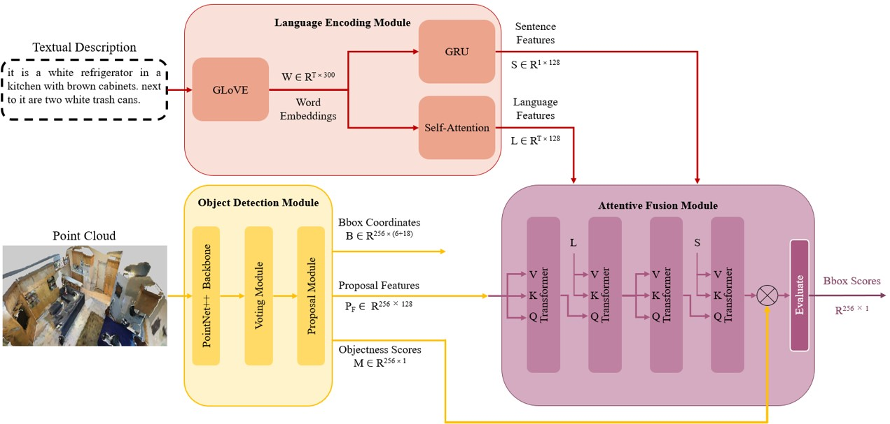

# TFVG3D: A Transformer-based Framework for Visual Grounding on 3D Point Clouds

This repo is the official implementation of "[A Transformer-based Framework for Visual Grounding on 3D Point Clouds](https://ieeexplore.ieee.org/document/10475280)".



Please refer to the paper for more details and visit the [ScanRefer](https://github.com/daveredrum/ScanRefer) repository for instructions on downloading the dataset.

## Necessary Packages 
All experiments were conducted using a single RTX 4090-12GB GPU.
* CUDA: 11.8
* PyTorch: 2.4.0
* python: 3.12

Execute the following command to install PyTorch:
```shell
pip install torch==2.4.0 torchvision==0.19.0 --index-url https://download.pytorch.org/whl/cu118
```

Install the necessary packages listed out in `req/requirements.txt`:
```shell
pip install -r req/requirements.txt
```

Run the following commands to compile the CUDA modules for the PointNet++ backbone:
```shell
cd pointnet2_ops_lib
python setup.py install
```

Before moving on to the next step, please don't forget to set the project root path to the `CONF.PATH.BASE` in `lib/config.py`.

## Training and Evaluation

* To train the model, run the following commands:

```shell
python ScanRefer_train.py --use_multiview --use_normal --no_height --batch_size 8 --lang_num_max 32 --epoch 50 --lr 0.002 --lang_lr 0.0005 --match_lr 0.0005 --coslr
```

* To evaluate the model, run the following commands:

```shell
python ScanRefer_eval.py --folder path --reference --use_multiview --use_normal --no_height --no_nms --force --repeat 1 --lang_num_max 1 --batch_size 32
```

* To generate predictions on ScanRefer hidden test set, run the following commands:

```shell
python benchmark/predict.py --folder path --use_multiview --use_normal --no_height --batch_size 32 
```

## TFVG3D++
We re-trained our model, incorporated the language classification loss (as in ScanRefer), and re-adjusted the weights of the loss function terms. As a result, the new model achieved significantly higher performance, with the results summarized in Tables 1 and 2.

settings:
3D Only (XYZ+RGB): --use_color --use_normal
2D+3D (XYZ+Multiview): --use_multiview --use_normal --no_height

|             Validation Set             |          |  Unique  |  Unique | Multiple | Multiple |  Overall | Overall |
|:--------------------------------------:|:--------:|:--------:|:-------:|:--------:|:--------:|:--------:|:-------:|
|                 Methods                | Modality | Acc@0.25 | Acc@0.5 | Acc@0.25 |  Acc@0.5 | Acc@0.25 | Acc@0.5 |
|                  SCRC                  |    2D    |   24.03  |   9.22  |   17.77  |   5.97   |   18.70  |   6.45  |
|                One-Stage               |    2D    |   29.32  |  22.82  |   18.72  |   6.49   |   20.38  |   9.04  |
|                                        |          |          |         |          |          |          |         |
|                ScanRefer               |    3D    |   67.64  |  46.19  |   32.06  |   21.26  |   38.97  |  26.10  |
|                  TGNN                  |    3D    |   68.61  |  56.80  |   29.84  |   23.18  |   37.37  |  29.70  |
|              InstanceRefer             |    3D    |   77.45  |  66.83  |   31.27  |   24.77  |   40.23  |  32.93  |
|                   SAT                  |    3D    |   73.21  |  50.83  |   37.64  |   25.16  |   44.54  |  30.14  |
|                                        |          |          |         |          |          |          |         |
|              TFVG3D (Ours)             |    3D    |   64.77  |  35.23  |   28.55  |   16.52  |   35.58  |  20.15  |
|             TFVG3D++ (Ours)            |    3D    |   76.10  |	55.23  |	 36.19  |	  26.10  |	 43.93  |	 31.75  |
|                                        |          |          |         |          |          |          |         |
|                                        |          |          |         |          |          |          |         |
|                ScanRefer               |  2D + 3D |   76.33  |  53.51  |   32.73  |   21.11  |   41.19  |  27.40  |
|                  TGNN                  |  2D + 3D |   68.61  |  56.80  |   29.84  |   23.18  |   37.37  |  29.70  |
|              InstanceRefer             |  2D + 3D |   75.72  |  64.66  |   29.41  |   22.99  |   38.40  |  31.08  |
|             TFVG3D++ (Ours)            |  2D + 3D |   80.38  |	59.30  | 	 36.49  |	  26.01	 |   45.00  |	 32.47  |


|            Online Benchmark            |           |  Unique  | Unique  | Multiple | Multiple | Overall  | Overall |
|:--------------------------------------:|:---------:|:--------:|:-------:|:--------:|:--------:|:--------:|:-------:|
|                 Methods                |  Modality | Acc@0.25 | Acc@0.5 | Acc@0.25 | Acc@0.5  | Acc@0.25 | Acc@0.5 |
|                ScanRefer               |  2D + 3D  |  68.59   |  43.53  |  34.88   |  20.97   |  42.44   |  26.03  |
|                  TGNN                  |  2D + 3D  |  68.34   |  58.94  |  33.12   |  25.26   |  41.02   |  32.81  |
|              InstanceRefer             |  2D + 3D  |  77.82   |  66.69  |  34.57   |  26.88   |  44.27   |  35.80  |
|             TFVG3D++ (Ours)            |  2D + 3D  |  74.53   |	 54.58  |	 37.93   |  26.90   |	46.14    |  33.11  |
